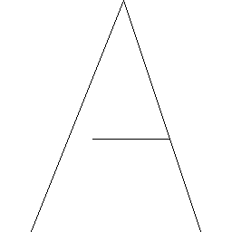

# Font

This is a description of the letters written in `font.h` - for more information
look there.

For simplicity, collections of letters can be switched off by defining a
variable to do so - meaning they won't be included in your application binary.

## Available

The following are generations from the available letters.

### A

### B

### C

