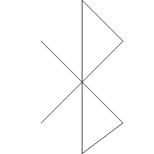

# Icons

This is a description of the icons written in `icons.h` - for more information
look there.

For simplicity, collections of icons can be switched off by defining a variable
to do so - meaning they won't be included in your application binary. To not
compile the bluetooth icon for example, simply `#define ICONS_NO_BLUETOOTH`.

## Available

The following are generations from the available icons.

### Bluetooth

### Message

