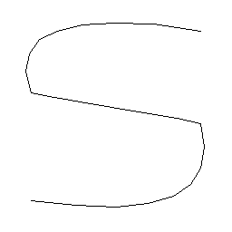
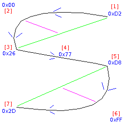

# PT Draw

PT draw is a drawing library for the pine time for drawing very simple line
art, including icons and fonts which are scalable to any size.

This project has several goals:

* Be small in RAM
* Be fast to run
* Be usable on low-end hardware
* Create simple, clean scalable graphics

## Example

The following is an example for drawing the letter "s" in 8 bytes (curves are
set to 8 segments).

    UINT8 l[8] = {CURV | (3 - 1), 0xD2, 0x00, 0x26, 0x77, 0xD8, 0xFF, 0x2D};
    pt_draw_create_bitmap(l, 8, buff, 256);

Output result:

In the following image you can see how the above HEX values influence the shape
of the curve.

Key:

* Blue - HEX values from the description sequence
* Red - Order of the bytes in the sequence (and order the shape is drawn)
* Green - Direct line to outer points
* Magenta - The pull from the "curve" point

## Documentation

The following is documentation on the project:

* [Algorithms](doc/algorithms.md)
* [API](doc/api.md)
* [Compiling](doc/compiling.md)
* [File format](doc/file-format.md)
* [Font](doc/font.md)
* [Icons](doc/icons.md)

## TODO

* [ ] Scaling bug (for small icons < 16 pixels)
* [ ] Basic icon set
* [ ] 7 bit ASCI font definition
* [ ] Test coverage (prevent code regression)
* [ ] Fuzzing for sequence input (no valid or invalid sequence should crash)
* [ ] Shape fill (for simple shapes, trying to keep efficient)
* [ ] Real-time anti-aliasing method for screen drawing
